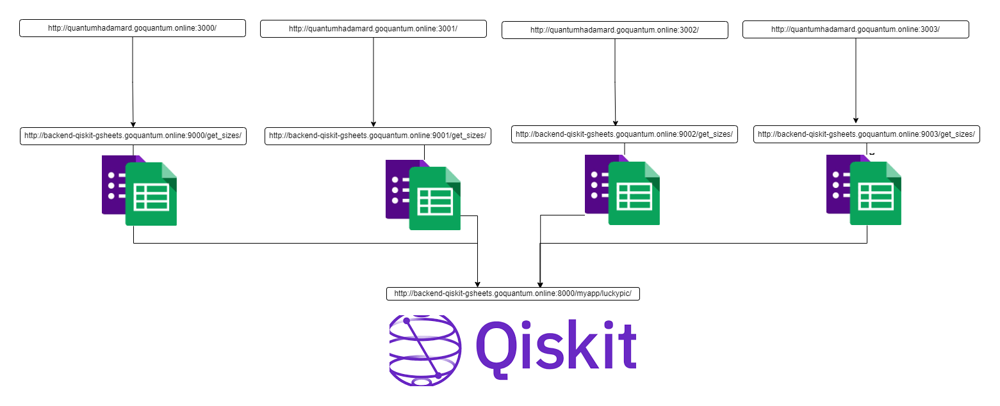

# Quantum T-Shirt Lucky Picker

The Quantum T-Shirt Lucky Picker is a web application that utilizes the Qiskit simulator to create a Hadamard gate, which creates an equal superposition of all qubits. The application uses Django as the backend framework and TypeScript, Next.js, React, and Tailwind CSS for the frontend.

## Usage

To use the application, follow these steps:

1.  Modify the `.env` file as necessary to configure the application.
    
2.  Run the wrapper script called `run.sh`. This will start the Django server and the Next.js development server.
    

```
./run.sh 
```

3.  Navigate to the application in your web browser at the specified URL.

## Credits

This application was created by Asher

# Current Architecture


